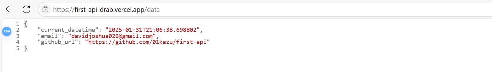

# FIRST API

This is a public API that returns my email address, the current date time as an ISO 8601 formatted timestamp, and the GitHub link of this repository.

To run this code locally, you need to follow these steps:
1. Clone the repository or Download the Zip files.
2. Create a virtual environment for the project
3. run "pip install -r requirements.txt" in the terminal of the activated virtual environment.
4. run "flask run" in the terminal.
5. In a browser, type "http://127.0.0.1:5000" to access API.

## API DOCUMENTATION

The API endpoint is https://first-api-drab.vercel.app/data.

This is the GET request format: GET https://first-api-drab.vercel.app/data.

The response format should be: 
<code>{
    "current_datetime": "2025-01-31T20:50:32.833244",
    "email": "davidjoshua026@gmail.com",
    "github_url": "https://github.com/01kazu/first-api"
} </code>

**Example**
In any browser, type "https://first-api-drab.vercel.app/data" and the data will be recieved.

https://hng.tech/hire/python-developers

